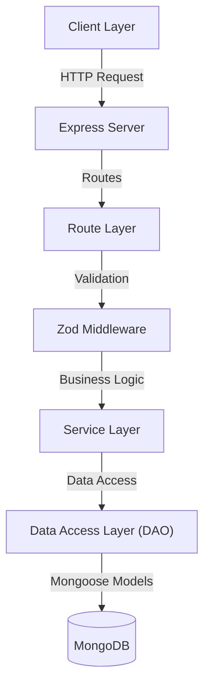

# Guestara Menu & Services Management Backend

A production-grade backend system for managing restaurant menus, services, and bookings. It supports hierarchical data organization, dynamic pricing models, smart tax inheritance, and conflict-free booking management.

## Table of Contents
- [Project Overview](#project-overview)
- [Architecture & Design](#architecture--design)
- [Data Modeling](#data-modeling)
- [Core Business Logic](#core-business-logic)
  - [Tax Inheritance](#tax-inheritance)
  - [Pricing Engine](#pricing-engine)
  - [Booking Conflict Prevention](#booking-conflict-prevention)
- [Technical Decisions & Tradeoffs](#technical-decisions--tradeoffs)
- [Setup & Local Development](#setup--local-development)
- [Testing](#testing)

---

## Project Overview

### Key Capabilities
- **Hierarchical Management**: Organize `Categories` → `Subcategories` → `Items` with strict validation.
- **Flexible Pricing**: 5 distinct pricing models (Static, Tiered, Complimentary, Discounted, Dynamic) supported via a polymorphic engine.
- **Rules-Based Tax**: Items inherit tax configurations from their subcategory or category hierarchy to minimize data duplication.
- **Robust Bookings**: Prevents double-booking using database transactions and precise time-slot conflict detection.
- **Advanced Search**: Filter items by price range, hierarchy, and text search across relationships.

---

## Architecture & Design

We follow a **Layered Architecture** to ensure Separation of Concerns, making the system testable, scalable, and easy to maintain.



### Layer Responsibilities
1.  **Route Layer**: Handles HTTP req/res, parses parameters, and invokes services.
2.  **Middleware**: Enforces request validation using **Zod schemas** before reaching the controller.
3.  **Service Layer (The Core)**: Contains all business logic (e.g., pricing calculations, tax inheritance, conflict checks). It is decoupled from HTTP concerns.
4.  **Data Access Layer (DAO)**: Abstract database operations to keep business logic clean of Mongoose primitives.

---

## Data Modeling

We use **MongoDB** for its schema flexibility, allowing us to store diverse pricing configurations and nested structures efficiently.

### Entity Relationships
-   **Category**: Root level container (e.g., "Beverages").
-   **Subcategory**: Optional intermediate level (e.g., "Hot Coffee").
-   **Item**: The sellable unit. **Constraint**: An item belongs to *either* a Category OR a Subcategory (XOR).
-   **Availability**: Time windows when an item can be booked.
-   **Booking**: Reservations linked to an item and customer.

### Schema Highlights
-   **Polymorphic Pricing**: stored as a `pricingConfig` object that changes structure based on `pricingType`.
-   **Embedded Add-ons**: Add-ons are embedded within Items for atomic access.
-   **References**: Categories and Subcategories are referenced (not embedded) to allow shared hierarchies.

---

## Core Business Logic

### 1. Tax Inheritance
To avoid managing tax settings for every single item, we implement a **runtime resolution strategy**.

**Logic Flow:**
1.  Check if the **Item** has specific tax rules defined.
2.  If not, check the **Subcategory** (if one exists).
3.  If not, fall back to the **Category** level.

```typescript
// Runtime Resolution Example
const tax = item.taxApplicable !== null 
    ? { applicable: item.taxApplicable, percentage: item.taxPercentage }
    : (item.subcategory?.taxApplicable !== null 
        ? item.subcategory 
        : item.category);
```
*Benefit*: Changing a Category's tax instantly updates all inheriting items without a database migration.

### 2. Pricing Engine
The pricing calculation is a pure function that adapts to the `PricingType` enum.

| Pricing Type | Logic |
| :--- | :--- |
| **Static** | Fixed price (`config.price`). |
| **Tiered** | Price determined by quantity (e.g., 1-2 items: $10, 3+ items: $8). |
| **Dynamic** | Price changes based on time of day (e.g., Happy Hour). |
| **Discounted** | Base price minus a flat or percentage discount. |
| **Complimentary** | Always returns 0. |

### 3. Booking Conflict Prevention
Booking conflicts (race conditions) are prevented using **MongoDB Transactions**.

**The Atomic Flow:**
1.  Start a Transaction session.
2.  **Lock & Check**: Query for any existing `CONFIRMED` bookings that overlap with the requested time slot.
3.  **Decide**:
    *   If conflict found: Abort and throw error.
    *   If clear: Create the booking.
4.  Commit Transaction.

```typescript
// Transactional Safety
const session = await mongoose.startSession();
session.startTransaction();
try {
    const conflict = await findConflictingBooking(..., session);
    if (conflict) throw new ConflictError();
    await createBooking(..., session);
    await session.commitTransaction();
} catch (e) {
    await session.abortTransaction();
}
```

---

## 🔌 API Documentation & Usage

### Core Endpoints

#### 1. Calculate Price (The 'Complex' Endpoint)
**GET** `/items/:id/price?quantity=2&time=10:30&addons[]=addon1`

*Calculates dynamic price based on context (time/quantity) and resolves tax inheritance.*

```json
{
  "success": true,
  "data": {
    "item_id": "...",
    "pricing_rule": "tiered",
    "base_price": 500,
    "addons": [{"name": "Projector", "price": 100}],
    "addon_total": 100,
    "subtotal": 600,
    "tax": {
      "applicable": true,
      "percentage": 18,
      "amount": 108,
      "inherited_from": "category" 
    },
    "grand_total": 708
  }
}
```

#### 2. Create Item (With Validation)
**POST** `/items`
```json
{
  "name": "Cappuccino",
  "//": "XOR Constraint: Provide category_id OR subcategory_id, not both",
  "category_id": "507f1f77bcf86cd799439011", 
  "pricing_type": "static",
  "pricing_config": { "price": 200 }
}
```

#### 3. Advanced Search
**GET** `/items?search=coffee&minPrice=100&category=beverages&sortBy=price`
*Uses MongoDB Aggregation Pipeline to filter across relationships.*

---

## 🧠 Advanced Engineering Decisions

### 1. Soft Deletes with "Virtual Cascading"
**The Problem**: When a Category is deleted, what happens to its Items?
*   **Physical Cascade**: Update all items to `is_active: false`. (Write heavy, hard to undo).
*   **Virtual Cascade** (Selected): Keep items untouched. Filter them out at runtime if their parent is inactive.
    *   *Benefit*: Data Integrity. We never lose the "history" of an item.
    *   *Tradeoff*: Queries are slightly more complex (must `$lookup` parent status).

### 2. Tax Inheritance: Why Runtime Resolution?
We considered three strategies for handling tax updates:

| Approach | Pros | Cons | Decision |
|----------|------|------|----------|
| **Denormalize** (Store on Item) | Fast reads | Stale data on update | ❌ |
| **Triggers** (Auto-update) | Always synced | DB-specific, hard to test | ❌ |
| **Runtime Resolution** | Always fresh | Logic in code, testable | ✅ |

### 3. Search via Aggregation Pipeline
We used MongoDB's Aggregation Framework instead of simple `.find()` queries to handling complex filtering (joining Categories, filtering by `pricingConfig.price` inside polymorphic objects) in a single database round-trip.

---

## 📝 Written Reflections

### 1. Why did you choose your database?
**MongoDB** was chosen over SQL for its flexibility with **polymorphic data structures**.
*   Our strict requirement was to support 5 different pricing models (`Static`, `Tiered`, `Dynamic`, etc.), each with a unique schema structure.
*   In a relational database like PostgreSQL, this would require either a complex EAV (Entity-Attribute-Value) pattern, multiple join tables, or a `JSONB` column that loses some type safety.
*   MongoDB allows us to store these varying `pricingConfig` objects naturally within the Item document, while Zod ensures we maintain application-level schema validation.

### 2. Three things you learned while building this
1.  **Transactional Complexity**: Implementing preventing double-bookings taught me that "checking availability" and "creating a booking" are not atomic operations. I learned how to use `mongoose.startSession()` to lock reads and writes, ensuring data integrity during race conditions.
2.  **Polymorphism in Practice**: I learned how to handle polymorphic data (Pricing Engine) cleanly in TypeScript by using Discriminated Unions (`type: 'static' | 'tiered'`) which allowed comprehensive type narrowing across the application.
3.  **Inheritance Design Patterns**: I learned how to implement inheritance patterns like Tax Inheritance using a runtime resolution strategy rather than database-level triggers, which kept the logic testable and decoupled from the DB.

### 3. The hardest technical design challenge
**Designing the Pricing Engine Integration**: The challenge was not just calculating the price, but integrating it seamlessly with the Item schema while keeping the database queryable.
*   *Challenge*: How to validate 5 different config structures at runtime?
*   *Solution*: We used Zod's `discriminatedUnion` to create a validator that changes its rules based on the `pricingType` field. This ensured that a `tiered` item always has `tiers` array, while a `static` item always has a `price` number, preventing corrupt data states.

### 4. What would you improve or refactor?
If I had more time, I would prioritize:
1.  **Cloudinary Integration**: Currently, images are simple URL strings. I would implement Cloudinary for actual image uploading, optimization, and resizing.
2.  **Authentication & Authorization**: The system currently assumes a trusted user. I would add JWT-based Auth to secure endpoints and add role-based access control (Admin vs Customer).
3.  **Redis & Rate Limiting**: To scale, I would add Redis to cache Category hierarchies (which rarely change) and implement Rate Limiting to prevent abuse of the Booking API.
4.  **Logging & Monitoring**: Implement structured logging (Winston/Pino) and set up monitoring (Prometheus) to track error rates and latency.
5.  **CI/CD Pipelines**: Automate testing and deployment workflows using GitHub Actions to ensure code quality on every push.

---

## Technical Decisions & Tradeoffs

### Why MongoDB?
*   **Decision**: Chosen over SQL.
*   **Reasoning**: Our pricing configurations (`pricingConfig`) vary significantly in structure. MongoDB's usage of JSON documents allows us to store these polymorphic structures naturally without complex `JSONB` columns or rigid join tables.
*   **Tradeoff**: We lose strict foreign key constraints, which we mitigate via application-level validation in the Service layer.

### Why Service Layer Pattern?
*   **Decision**: All logic resides in Services, not Controllers or Models.
*   **Reasoning**: This makes unit testing significantly easier. We can test `PriceService.calculate()` without mocking an Express `Request` object or a Database connection.

### runtime Validation (Zod)
*   **Decision**: Use Zod for strict input validation.
*   **Reasoning**: TypeScript guarantees compile-time safety, but Zod guarantees runtime safety. It catches bad inputs (e.g., negative prices, missing fields) before they enter our business logic.

---

## Setup & Local Development

### Prerequisites
- Node.js v18+
- Docker (optional, for local DB)
- MongoDB (if running locally without Docker)

### Installation
1.  **Clone the repository**:
    ```bash
    git clone <repo_url>
    cd guestara-assignment
    ```

2.  **Install dependencies**:
    ```bash
    npm install
    ```

3.  **Configure Environment**:
    ```bash
    cp configs/.local.env.example configs/.local.env
    # Update DATABASE_URL in .local.env if needed
    ```

### Running the App
**Development Mode** (with hot-reload):
```bash
npm run dev
```

**Production Build**:
```bash
npm run local
```

Access the API at `http://localhost:3000`.

---

## 🧪 Testing

We use **Jest** for our testing framework. The suite covers:
-   **Unit Tests**: Logic verification (Pricing, Tax).
-   **Integration Tests**: Service + Database interaction (using `mongodb-memory-server`).

### Running Tests
To run the full test suite:
```bash
npm test
```

To run a specific test file:
```bash
npm test -- category.test.ts
```

### Recent Improvements
-   **Type Safety**: All tests are fully typed with TypeScript.
-   **Enum Usage**: Standardized `PricingType` and `DayOfWeek` across all test mocks.
-   **Verification**: Validated via `tsc --noEmit` to ensure zero compilation errors.
