# Guestara Menu & Services Management Backend

<div align="center">


**A backend system for managing restaurant menus, services, and bookings with dynamic pricing, tax inheritance, and conflict-free booking management.**

</div>

---

## Table of Contents

- [Project Overview](#-project-overview)
- [Architecture & Design](#-architecture--design)
- [Data Modeling](#-data-modeling)
- [Data Flow](#-data-flow)
- [Entity Relationship Diagram](#-entity-relationship-diagram)
- [Core Business Logic](#-core-business-logic)
  - [Tax Inheritance](#1-tax-inheritance-critical)
  - [Pricing Engine](#2-pricing-engine)
  - [Booking & Availability](#3-booking--availability-system)
  - [Add-ons System](#4-add-ons-system)
- [API Documentation](#-api-documentation)
- [Technical Decisions & Tradeoffs](#-technical-decisions--tradeoffs)
- [Setup & Local Development](#-setup--local-development)
- [Testing](#-testing)
- [Written Reflections](#-written-reflections)

---

## Project Overview

This is a **Menu & Services Management Backend** similar to what a real restaurant/booking/SaaS product would use. The system manages hierarchical data organization with smart business logic.

### Key Capabilities

| Feature | Description |
|---------|-------------|
| **Hierarchical Management** | Organize `Categories` → `Subcategories` → `Items` with strict validation |
| **5 Pricing Models** | Static, Tiered, Complimentary, Discounted, Dynamic (time-based) |
| **Tax Inheritance** | 3-level runtime resolution: Item → Subcategory → Category |
| **Booking System** | Transaction-based double-booking prevention with availability rules |
| **Add-ons Engine** | Optional & mandatory add-ons with grouping support |
| **Soft Deletes** | No hard deletes – preserves data integrity with `isActive` flag |
| **Advanced Search** | Filter by price, category, text search with pagination & sorting |

---

## Architecture & Design

We follow a **Layered Architecture** pattern to ensure Separation of Concerns, making the system testable, scalable, and easy to maintain.


### Layer Responsibilities

| Layer | Responsibility |
|-------|---------------|
| **Route Layer** | HTTP req/res handling, parameter parsing, response formatting |
| **Validation Middleware** | Request validation using **Zod schemas** with discriminated unions |
| **Service Layer** | Core business logic (pricing, tax inheritance, conflict detection) |
| **Data Access Layer (DAO)** | Database operations abstracted from business logic |
| **Database** | MongoDB with Typegoose for type-safe models |

### Folder Structure

```
src/
├── common/
│   ├── types/           # Shared TypeScript types & enums
│   │   ├── pricing.ts   # PricingType, PricingConfig, PriceBreakdown
│   │   ├── booking.ts   # BookingStatus, AvailableSlot
│   │   └── availibility.ts
│   └── utils/           # Error handlers, helpers
├── config/              # Database & app configuration
├── middleware/          # Async handler, Zod validation
├── route/               # Express routers with Swagger docs
│   ├── category.ts
│   ├── subcategory.ts
│   ├── item.ts
│   ├── availability.ts
│   └── booking.ts
└── services/
    ├── category/        # schema.ts, dao.ts, validation.ts
    ├── subcategory/
    ├── items/           # + calculatePrice logic
    ├── availability/
    └── booking/         # + conflict detection
```

---

## Data Modeling

We use **MongoDB** for its schema flexibility, allowing us to store diverse pricing configurations and nested structures efficiently.

### Core Entities

#### 1. Category (Root Level)
```typescript
{
  name: string,           // Required, unique
  image?: string,
  description?: string,
  taxApplicable: boolean, // Required
  taxPercentage?: number, // Required if taxApplicable = true
  isActive: boolean       // Default: true (soft delete)
}
```

#### 2. Subcategory (Optional Middle Level)
```typescript
{
  categoryId: ObjectId,      // Reference to parent Category
  name: string,              // Unique within same category
  image?: string,
  description?: string,
  taxApplicable?: boolean | null,  // null = inherit from category
  taxPercentage?: number | null,   // null = inherit from category
  isActive: boolean
}
```

#### 3. Item (Sellable Unit)
```typescript
{
  name: string,
  description?: string,
  image?: string,
  // XOR Constraint: EITHER categoryId OR subcategoryId (not both)
  categoryId?: ObjectId,
  subcategoryId?: ObjectId,
  pricingType: 'static' | 'tiered' | 'complimentary' | 'discounted' | 'dynamic',
  pricingConfig: PricingConfig,  // Polymorphic based on pricingType
  taxApplicable?: boolean | null,
  taxPercentage?: number | null,
  isBookable: boolean,           // Enables availability rules
  addons: Addon[],               // Embedded array
  isActive: boolean
}
```

#### 4. Availability (Booking Rules)
```typescript
{
  itemId: ObjectId,                               // Reference to bookable Item
  dayOfWeek: 'MON' | 'TUE' | 'WED' | 'THU' | 'FRI' | 'SAT' | 'SUN',
  startTime: string,                              // "HH:MM" format
  endTime: string,
  isActive: boolean
}
```

#### 5. Booking (Reservations)
```typescript
{
  itemId: ObjectId,
  bookingDate: Date,
  startTime: string,
  endTime: string,
  customerName: string,
  customerEmail?: string,
  customerPhone?: string,
  status: 'confirmed' | 'cancelled'
}
```

---

## Data Flow

The complete data flow from Category creation to Booking:

```mermaid
flowchart TD
    subgraph "1️⃣ Setup Phase"
        A[Create Category] --> B[Create Subcategory]
        B --> C[Create Item]
        A --> C
        C --> D{Is Bookable?}
        D -->|Yes| E[Create Availability Rules]
        D -->|No| F[Item Ready for Orders]
    end
    
    subgraph "2️⃣ Price Calculation"
        G[GET /items/:id/price] --> H{Pricing Type?}
        H -->|Static| I[Fixed Price]
        H -->|Tiered| J[Calculate by Quantity]
        H -->|Dynamic| K[Calculate by Time Window]
        H -->|Discounted| L[Apply Discount]
        H -->|Complimentary| M[Price = 0]
        
        I & J & K & L & M --> N[+ Add-on Prices]
        N --> O[Resolve Tax Inheritance]
        O --> P[Return Price Breakdown]
    end
    
    subgraph "3️⃣ Booking Flow"
        Q[GET /bookings/availableSlots/:itemId] --> R[Check Availability Rules]
        R --> S[Get Existing Bookings]
        S --> T[Calculate Available Slots]
        
        U[POST /bookings/createBooking] --> V{Item Bookable?}
        V -->|No| W[❌ Error: Not Bookable]
        V -->|Yes| X{Within Availability?}
        X -->|No| Y[❌ Error: Outside Hours]
        X -->|Yes| Z[Start Transaction]
        Z --> AA{Check Conflicts}
        AA -->|Conflict| AB[❌ Error: Already Booked]
        AA -->|Clear| AC[✅ Create Booking]
        AC --> AD[Commit Transaction]
    end
    
    subgraph "4️⃣ Tax Inheritance Chain"
        TA[Item.taxApplicable] -->|null| TB[Check Subcategory]
        TB -->|null| TC[Use Category Tax]
        TB -->|defined| TD[Use Subcategory Tax]
        TA -->|defined| TE[Use Item Tax]
    end
```



### Detailed Flow Description

| Step | Action | Description |
|------|--------|-------------|
| **1** | Create Category | Define root-level grouping with tax settings |
| **2** | Create Subcategory | Optional subdivision, can inherit or override tax |
| **3** | Create Item | Attach to Category OR Subcategory (XOR), configure pricing |
| **4** | Add Availability | Define when bookable items are available |
| **5** | Calculate Price | Resolve pricing + addons + inherited tax dynamically |
| **6** | Check Slots | Query available time slots for a date |
| **7** | Create Booking | Transactional booking with conflict prevention |

---

## Entity Relationship Diagram


---

## Core Business Logic

### 1. Tax Inheritance (Critical)

To avoid managing tax settings for every single item, we implement a **runtime resolution strategy**:


**Implementation:**
```typescript
// Runtime Resolution in calculateItemPrice()
function resolveTax(item: Item): TaxInfo {
  // Level 1: Check Item
  if (item.taxApplicable !== null) {
    return { 
      taxApplicable: item.taxApplicable, 
      taxPercentage: item.taxPercentage,
      inheritedFrom: 'item' 
    };
  }
  
  // Level 2: Check Subcategory (if exists)
  if (item.subcategoryId?.taxApplicable !== null) {
    return { 
      taxApplicable: item.subcategoryId.taxApplicable,
      taxPercentage: item.subcategoryId.taxPercentage,
      inheritedFrom: 'subcategory' 
    };
  }
  
  // Level 3: Fall back to Category
  const category = item.subcategoryId?.categoryId ?? item.categoryId;
  return {
    taxApplicable: category.taxApplicable,
    taxPercentage: category.taxPercentage,
    inheritedFrom: 'category'
  };
}
```

> **Why Runtime Resolution?**
> - ✅ Changing a Category's tax instantly updates all inheriting items
> - ✅ No database migration required
> - ✅ Logic is testable in isolation
> - ✅ No stale data issues

### 2. Pricing Engine

Each item supports **exactly one** pricing type. The pricing calculation is a pure function:

| Pricing Type | Logic | Example |
|--------------|-------|---------|
| **Static** | Fixed price | Cappuccino: ₹200 |
| **Tiered** | Price by quantity tier | Meeting Room: 1hr→₹300, 2hr→₹500 |
| **Complimentary** | Always 0 | Welcome Drink |
| **Discounted** | Base price - discount | ₹500 - 20% = ₹400 |
| **Dynamic** | Price by time window | Breakfast: 8am-11am→₹199 |

**Polymorphic Configuration (Zod Discriminated Union):**
```typescript
const pricingConfigSchema = z.discriminatedUnion('type', [
  z.object({ type: z.literal('static'), price: z.number().min(0) }),
  z.object({ type: z.literal('tiered'), tiers: tiersSchema }),
  z.object({ type: z.literal('complimentary') }),
  z.object({ type: z.literal('discounted'), basePrice: z.number(), discount: discountSchema }),
  z.object({ type: z.literal('dynamic'), windows: timeWindowsSchema }),
]);
```

**Price Calculation Endpoint Response:**
```json
GET /items/:id/price?quantity=2&time=10:30&addonIds=Extra%20Shot

{
  "itemId": "...",
  "itemName": "Cappuccino",
  "pricingRule": "static",
  "basePrice": 200,
  "addons": [{ "name": "Extra Shot", "price": 50 }],
  "addonTotal": 50,
  "subtotal": 250,
  "tax": {
    "taxApplicable": true,
    "taxPercentage": 8,
    "amount": 20,
    "inheritedFrom": "category"
  },
  "grandTotal": 270
}
```

### 3. Booking & Availability System

**Availability Rules** define when items can be booked:
```
Meeting Room:
  - MON-FRI: 09:00 - 17:00
  - SAT: 10:00 - 14:00
```

**Conflict Prevention with Transactions:**
```typescript
const session = await mongoose.startSession();
session.startTransaction();

try {
  // 1. Check for overlapping CONFIRMED bookings (with session lock)
  const conflict = await BookingModel.findOne({
    itemId,
    bookingDate,
    status: 'confirmed',
    $or: [
      { startTime: { $lte: startTime }, endTime: { $gt: startTime } },
      { startTime: { $lt: endTime }, endTime: { $gte: endTime } },
      { startTime: { $gte: startTime }, endTime: { $lte: endTime } },
    ],
  }).session(session);

  if (conflict) {
    throw new ConflictError(`Time slot already booked: ${conflict.startTime}-${conflict.endTime}`);
  }

  // 2. Create booking atomically
  await BookingModel.create([bookingData], { session });
  await session.commitTransaction();
} catch (error) {
  await session.abortTransaction();
  throw error;
}
```

### 4. Add-ons System

Add-ons are **embedded** within Items for atomic access:

```typescript
addons: [
  { name: "Extra Shot", price: 50, isMandatory: false, addonGroup: "Extras" },
  { name: "Oat Milk", price: 40, isMandatory: false, addonGroup: "Milk Options" },
  { name: "Choice of Cup", price: 0, isMandatory: true, addonGroup: null }
]
```

**Rules:**
- Mandatory add-ons are automatically included in price calculation
- Optional add-ons can be selected via `addonIds` query parameter
- Add-on groups support "Choose 1 of N" scenarios

---

## API Documentation

Interactive Swagger documentation available at: **`http://localhost:{PORT}/api-docs`**

### API Endpoints Overview

#### Categories
| Method | Endpoint | Description |
|--------|----------|-------------|
| POST | `/api/v1/categories/createCategory` | Create category |
| GET | `/api/v1/categories/getAllCategories` | List with pagination |
| GET | `/api/v1/categories/getCategoryById/:id` | Get single category |
| PATCH | `/api/v1/categories/updateCategory/:id` | Update category |
| PATCH | `/api/v1/categories/softDeleteCategory/:id` | Soft delete |

#### Subcategories
| Method | Endpoint | Description |
|--------|----------|-------------|
| POST | `/api/v1/subcategories/createSubcategory` | Create subcategory |
| GET | `/api/v1/subcategories/getAllSubcategories` | List with pagination |
| GET | `/api/v1/subcategories/getSubcategoryById/:id` | Get single |
| GET | `/api/v1/subcategories/getSubcategoriesByCategoryId/:categoryId` | By category |
| GET | `/api/v1/subcategories/getTax/:id` | Get resolved tax info |
| PATCH | `/api/v1/subcategories/updateSubcategory/:id` | Update |
| PATCH | `/api/v1/subcategories/softDeleteSubcategory/:id` | Soft delete |

#### Items
| Method | Endpoint | Description |
|--------|----------|-------------|
| POST | `/api/v1/items/createItem` | Create item with pricing |
| GET | `/api/v1/items/getAllItems` | List with filters & pagination |
| GET | `/api/v1/items/getItemById/:id` | Get single item |
| **GET** | **`/api/v1/items/getItemPrice/:id`** | **Calculate price** |
| PATCH | `/api/v1/items/updateItem/:id` | Update item |
| PATCH | `/api/v1/items/softDeleteItem/:id` | Soft delete |

#### Availability
| Method | Endpoint | Description |
|--------|----------|-------------|
| POST | `/api/v1/availabilities/createAvailability` | Create availability rule |
| GET | `/api/v1/availabilities/getAllAvailabilities` | List rules |
| GET | `/api/v1/availabilities/getAvailabilityById/:id` | Get single |
| PATCH | `/api/v1/availabilities/updateAvailability/:id` | Update |
| PATCH | `/api/v1/availabilities/softDeleteAvailability/:id` | Soft delete |

#### Bookings
| Method | Endpoint | Description |
|--------|----------|-------------|
| POST | `/api/v1/bookings/createBooking` | Create booking (conflict-safe) |
| GET | `/api/v1/bookings/getAllBookings` | List with pagination |
| GET | `/api/v1/bookings/getBookingById/:id` | Get single |
| **GET** | **`/api/v1/bookings/getAvailableSlots/:itemId`** | **Get available slots** |
| PATCH | `/api/v1/bookings/cancelBooking/:id` | Cancel booking |

---

## ⚖️ Technical Decisions & Tradeoffs

### 1. Why MongoDB?
| Aspect | Decision | Reasoning |
|--------|----------|-----------|
| **Polymorphic Data** | ✅ MongoDB | Pricing configs vary by type; natural JSON storage |
| **Relationships** | Hybrid | References for hierarchy, embedded for addons |
| **Tradeoff** | ⚠️ | No strict FK constraints – mitigated by app-level validation |

### 2. Why Runtime Tax Resolution vs. Denormalization?
| Approach | Pros | Cons | Decision |
|----------|------|------|----------|
| **Denormalize** | Fast reads | Stale on parent update | ❌ |
| **DB Triggers** | Always synced | DB-specific, hard to test | ❌ |
| **Runtime Resolution** | Always fresh, testable | Slight read overhead | ✅ |

### 3. Why Embedded Add-ons vs. Reference?
| Approach | Pros | Cons | Decision |
|----------|------|------|----------|
| **Embedded** | Atomic reads, no joins | Slight duplication | ✅ |
| **Referenced** | Reusable across items | Extra queries | ❌ |

### 4. Soft Delete Strategy: Virtual Cascading
When a Category is deactivated, we chose **Virtual Cascade** (filter at runtime) over **Physical Cascade** (update all children):
- ✅ Data integrity preserved
- ✅ Easy to undo
- ⚠️ Queries slightly more complex (must check parent status)

---

## Setup & Local Development

### Prerequisites
- Node.js v18+
- MongoDB 7.0+ (or Docker)

### Installation

```bash
# 1. Clone repository
git clone <repo_url>
cd guestara-assignment

# 2. Install dependencies
npm install

# 3. Configure environment
cp configs/.local.env.example configs/.local.env
# Update DATABASE_URL in .local.env
```

### Running the App

**Development Mode** (with hot-reload):
```bash
npm run dev
```

**Production Build**:
```bash
npm run local
```

**With Docker** (MongoDB):
```bash
docker-compose up -d
npm run dev
```

Access the API at: **`http://localhost:{PORT}`**
Swagger Docs at: **`http://localhost:{PORT}/api-docs`**

---

## Testing

We use **Jest** with **mongodb-memory-server** for isolated testing.

### Test Categories
| Type | Coverage |
|------|----------|
| **Unit Tests** | Pricing calculations, tax resolution |
| **Integration Tests** | Service + DAO with in-memory DB |
| **API Tests** | Route validation & response format |

### Running Tests

```bash
# Full test suite
npm test

# Specific test file
npm test -- category.test.ts

# With coverage
npm run test:coverage
```

### Test Highlights
- ✅ Booking conflict prevention verified
- ✅ Tax inheritance chain tested
- ✅ Pricing engine edge cases covered
- ✅ Zero TypeScript compilation errors (`tsc --noEmit`)

---

## 📝 Written Reflections

### 1. Why did you choose your database?

**MongoDB** was chosen over SQL for its flexibility with **polymorphic data structures**.

Our strict requirement was to support 5 different pricing models (`Static`, `Tiered`, `Dynamic`, etc.), each with a unique schema structure. In a relational database like PostgreSQL, this would require either:
- A complex EAV (Entity-Attribute-Value) pattern
- Multiple join tables
- A `JSONB` column that loses some type safety

MongoDB allows us to store these varying `pricingConfig` objects naturally within the Item document, while **Zod** ensures we maintain application-level schema validation.

### 2. Three things I learned while building this

1. **Transactional Complexity**: Implementing double-booking prevention taught me that "checking availability" and "creating a booking" are not atomic operations. I learned how to use `mongoose.startSession()` to lock reads and writes, ensuring data integrity during race conditions.

2. **Polymorphism in TypeScript**: I learned how to handle polymorphic data (Pricing Engine) cleanly using **Discriminated Unions** (`type: 'static' | 'tiered'`), which allowed comprehensive type narrowing across the application.

3. **Inheritance Design Patterns**: Implementing Tax Inheritance using a runtime resolution strategy (rather than database-level triggers) kept the logic testable and decoupled from the database engine.

### 3. The hardest technical/design challenge

**Designing the Pricing Engine Integration**: The challenge was not just calculating the price, but integrating it seamlessly with the Item schema while keeping the database queryable.

- **Challenge**: How to validate 5 different config structures at runtime?
- **Solution**: We used Zod's `discriminatedUnion` to create a validator that changes its rules based on the `pricingType` field. This ensured that a `tiered` item always has a `tiers` array, while a `static` item always has a `price` number, preventing corrupt data states at the API layer.

### 4. What would you improve with more time?

| Priority | Improvement |
|----------|-------------|
| **High** | **Authentication & RBAC**: JWT-based auth with admin/customer roles |
| **High** | **Redis Caching**: Cache category hierarchies, rate limit booking API |
| **Medium** | **Cloudinary Integration**: Actual image upload vs. URL strings |
| **Medium** | **Logging & Monitoring**: Winston/Pino + Prometheus metrics |
| **Low** | **CI/CD Pipelines**: GitHub Actions for automated testing & deployment |
